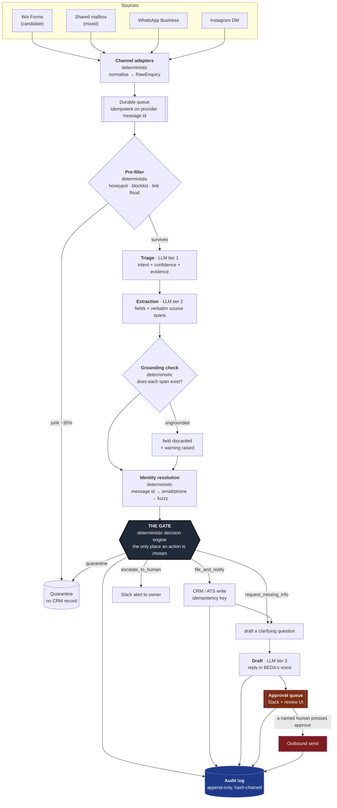

# Enquiry intake, triage and response — system design

**For:** We Are BEDA
**Scope:** ingest enquiries from email, the website form and messaging channels; identify what each one is; extract structured information; fill or request gaps; create or update the right record; draft the next response; alert the right person; keep a trail that stands up to scrutiny.

---

## 0. What BEDA actually is, and why it changes the design

Most enquiry-triage designs assume one funnel: leads come in, good ones become deals. That assumption is wrong here, and building on it would produce a system that quietly does damage.

BEDA is a **two-sided business**. It recruits sales and marketing professionals, relocates them to Bali, and places them with Australian companies. So two completely different kinds of person write in:

- **Clients** — Australian companies who want to hire through BEDA.
- **Candidates** — individuals who want to work through BEDA and move to Bali.

They belong in different systems of record, with different owners, different SLAs, and — critically — different privacy obligations. A candidate's file contains their location, their LinkedIn, their Instagram handle and their career history. A client's file contains commercial terms.

**The expensive failure in this system is not misjudging a lead's value. It is crossing the two sides.** A candidate dropped into the sales pipeline is a privacy incident and an insult to someone who trusted BEDA with their relocation plans. A client filed as a candidate is revenue that silently never gets called back.

Everything below is organised around not doing that.

### What the current setup tells us

I looked at [wearebeda.com](https://www.wearebeda.com/) before designing anything. Three things matter:

1. **The site is Wix**, and the enquiry form is Wix Forms. There is no backend to extend. The design has to be a small service that Wix, a mailbox and a messaging API can push into — not a platform rebuild.
2. **The public form is candidate-only by construction.** Its fields are Full name, Current Location, Current Role, Sales or Marketing, LinkedIn, Instagram. There is no company field, no headcount field, nothing a client would fill in. This is a fact the system can rely on, and I do rely on it — see the channel rule in §4.
3. **Client enquiries therefore arrive unstructured**, by email or DM, in whatever shape the sender chose. That is precisely the "inconsistent incoming information" in the brief, and it is where the extraction work is genuinely needed.

BEDA's privacy policy already commits to sharing candidate data with *"BEDA-affiliated entities and hiring partners (including Australian companies)"* and notes *"international processing"*. That commitment is the boundary this system has to stay inside. See §6.

---

## 1. Architecture



### The one structural idea

**Nothing reaches the outbound sender except through the approval queue.** That is not a policy written in a prompt or a config flag someone can flip in a hurry. In the reference implementation, the outbound sender is a separate port that the pipeline holds no reference to; the pipeline can only enqueue. A bug, a bad model response, or a successful prompt injection cannot send an email, because there is no code path from the pipeline to the sender.

Everything else in this document is detail. That is the design.

---

## 2. Model and tool choices

### Gateway: OpenRouter

All inference goes through **OpenRouter** rather than a direct provider SDK.

**Why:**
- **A model becomes config, not a dependency.** Re-tiering a task is a one-line change in `src/config/models.ts`, not a refactor.
- **Vendor portability, cheaply.** Today every tier runs on DeepSeek. Moving one tier to another vendor -- or adding cross-vendor failover -- is a line in a config file, with no other change anywhere in the system. That optionality is the whole reason to put a gateway in front before you need it.
- **One billing relationship** for a business that does not want four vendor contracts, and per-request cost attribution for free.

**The honest trade-offs**, because they are real:
- An extra network hop, roughly 50–150 ms. Acceptable here — this pipeline is asynchronous and the human SLA is measured in minutes.
- **Payloads pass through a third party.** For candidate PII crossing from Indonesia to Australia this matters. Mitigations in §6; the short version is `provider.data_collection: "deny"`, a pinned provider allowlist, and redaction before the call.
- Structured-output support varies by underlying provider. Handled by validating every response against a Zod schema and treating a parse failure as a normal, expected event with a repair retry and a fallback model.

### The tiers

| Tier | Job | Model | $/1M in | $/1M out | Why this one |
|---|---|---|---|---|---|
| 0 | Spam, honeypot, replay | **none** | — | — | A regex is faster, free, deterministic, and removes an injection surface. |
| 1 | Triage: which of 8 intents | `deepseek/deepseek-v4-flash-0731` | 0.065 | 0.18 | Runs on 100% of real traffic. Output is a closed enum that a deterministic gate re-checks, so raw capability matters less than throughput and price. |
| 2 | Extraction into schema | `deepseek/deepseek-v4-flash-0731` | 0.065 | 0.18 | Same reasoning. Every field is span-verified afterwards, so an error is caught, not absorbed. |
| 3 | Escalated triage/extraction | `deepseek/deepseek-v4-pro-0813` | 1.12 | 3.35 | Fires on low confidence or anything client-side — about 10% of volume, and the 10% that carries revenue. Stronger reasoning is worth ~17× on that slice. |
| 4 | Drafting replies | `deepseek/deepseek-v4-pro-0813` | 1.12 | 3.35 | The draft is BEDA's voice, and "The Power of Good Advice" is the product. A human reads every draft, so volume is capped by review capacity, not by us. |

Prices are live OpenRouter rates at time of writing and live in one config file so they can be re-checked rather than trusted.

**Fallback chains:**

```
triage    → deepseek-v4-flash → deepseek-v4-pro
extract   → deepseek-v4-flash → deepseek-v4-pro
escalated → deepseek-v4-pro   → deepseek-v4-flash
draft     → deepseek-v4-pro   → deepseek-v4-flash
```

**This is a single-vendor chain, and that is worth naming rather than hiding.** A
DeepSeek-wide outage takes out every tier at once, where a cross-vendor chain
would not. I am comfortable with it here because of what happens next: the
pipeline degrades to a human triage queue on a *tighter* 60-minute SLA rather
than guessing or dropping anything (§4.4). The failure mode is "slower, staffed
by people", not "wrong" — and for a business this size, a few hours a year of
manual triage is a cheaper problem than a second vendor relationship.

If that trade stops looking right — volume grows, or the team shrinks — adding
`qwen3.8-flash` or a Claude model as a third link is one line per chain and no
other change. That is the optionality the gateway was bought for.

### What I chose *not* to use

- **No agent framework** (LangChain, CrewAI, or similar). The steps in this pipeline are known in advance and never vary. Letting a model choose the next step buys flexibility this problem does not have, and pays for it in latency, cost, and a control flow nobody can unit-test. The orchestrator is a linear async function. The genuinely agentic work — deciding what is missing, composing a question, drafting a reply — happens *inside* single bounded calls.
- **No embeddings for deduplication.** Normalised string matching beats semantic similarity at "is this the same person", and it is deterministic and auditable. Embeddings would earn their place for "have we seen a similar enquiry before" analytics, which is not this system.
- **No fine-tuning.** At BEDA's volume there is not enough labelled data, and the taxonomy will change faster than a fine-tune cycle. Revisit at ~50k labelled enquiries.

### Surrounding tools

| Need | Choice | Why |
|---|---|---|
| Ingestion from the site | Wix Automations webhook → HTTPS endpoint | The site is Wix. Work with it rather than around it. |
| Email ingestion | Google Workspace push notifications → Pub/Sub | Near-real-time without polling a mailbox. |
| Queue + state | Postgres (Supabase) with `SELECT … FOR UPDATE SKIP LOCKED` | One dependency doing queue, state and audit. Kafka here would be a costume, not a decision. |
| CRM | Behind a `CrmPort`; HubSpot as the concrete adapter | Realistic for an agency of this size, and swappable. The pipeline never names a vendor. |
| Human interface | Slack (alerts + approve/edit/reject) with a thin web queue for anything long | The team already lives in Slack. An approval surface nobody opens is not an approval surface. |
| Secrets | Cloud secret manager, injected at runtime | Never in Wix, never in the repo, rotated on a schedule. |

---

## 3. What is an LLM, and what stays deterministic

The rule I applied throughout:

> **The LLM is a sensor, not an actuator.** It reads, labels and drafts. It never decides and never acts.

| Deterministic code | LLM |
|---|---|
| Channel adapters, normalisation | Intent classification |
| Spam heuristics, honeypot, blocklist | Field extraction into a fixed schema |
| **Which action to take** (the gate) | Summarising an enquiry for a human |
| Confidence thresholds and SLA timers | Composing the clarifying question |
| Which fields are required per intent | Drafting the reply in BEDA's voice |
| Identity resolution and merge policy | Translating an enquiry that arrives in another language |
| Idempotency keys and CRM writes | |
| Grounding verification | |
| Permission checks, redaction | |
| Retries, fallback, circuit breaking | |
| **Anything that sends** | |

### Why routing must not be an LLM decision

BEDA's routing rules are business policy: who owns client enquiries, how fast support must be answered, what counts as too big to auto-file. Policy needs to be readable, arguable, diffable in a pull request, and unit-testable.

A model-made decision is none of those. It cannot be reviewed before it ships, and it changes silently when a provider rotates a checkpoint. Putting policy in a prompt means the business logic lives somewhere no one can code-review.

So the gate (`src/pipeline/gate.ts`) is ~120 lines of ordinary TypeScript with no network calls, covered by 12 tests. Every decision it makes carries a named reason string. When someone asks "why did this go to #beda-ops", the answer is a rule name, not a vibe.

**This is also the security boundary.** The model in the classification path has no tools, no credentials, and a closed output schema. The worst a successful prompt injection achieves is a wrong label — which the gate still has to accept, and which the channel rule in §4 will reject outright if it is the dangerous kind.

---

## 4. Failure handling

### 4.1 Incomplete information

Most enquiries are incomplete. `"hi do you guys supply sales people? whats the pricing"` is a real message shape and the system must handle it without either inventing a company name or dropping a genuine buyer.

Required fields are declared per intent, in code:

```ts
client_new_business: ["companyName", "contactName", "email", "rolesSought"]
candidate_application: ["contactName", "email", "track"]
support:               ["contactName", "email", "issueSummary"]
```

Three outcomes:

1. **Complete** → file the record, notify the owner, draft a reply for approval.
2. **Incomplete but contactable** → draft a clarifying question that asks **only** for the named missing fields. Still requires approval to send.
3. **Incomplete and uncontactable** → escalate to a human. Never guess, never silently discard.

**On "research the missing information":** the brief invites enrichment, and I would build it — but narrowly. For a **client**, looking up a company from its email domain (public website, ABN register) is fair, cheap and reversible, and enriched fields are stored flagged as `source: enriched` so nobody mistakes them for something the client said. For a **candidate**, no. See §7.

### 4.2 Hallucination

Three layers, weakest to strongest.

**Prompt-level (weak, but free).** The extraction prompt says: never infer, never normalise, never complete; `null` is always the safe answer and is expected for most fields. Prompts help. They are not a control.

**Schema-level.** Closed enums for intent. Every field either matches the schema or the response is rejected and retried.

**Span grounding (the real control).** For every extracted field the model must return the **verbatim substring** of the enquiry it read the value from. Deterministic code then checks that span actually appears in the source. If it does not, the field is discarded before it reaches any decision.

For high-risk fields — email, phone, company name, headcount, budget — there is a second check: the **value** must also appear inside the span. This catches the nastiest failure mode, where a model quotes a genuine sentence and attaches an invented number to it:

```
source:  "we want to put on 2 appointment setters"
model:   headcount = { value: "20", sourceSpan: "put on 2 appointment setters" }
         → span is real, value is not → DROPPED
```

A naive "is the quote real" check passes that. This one does not.

**What grounding buys.** It converts hallucination from an unbounded failure — *the system quoted against a budget the client never mentioned* — into a bounded one: the field comes back empty and the gate asks the human. Empty is recoverable. Confidently wrong is not.

**Grounding failures are also a signal, not just a gap.** One dropped field is noise. Two or more means the model was improvising about this particular enquiry, and nothing it said is trustworthy enough to file — the whole enquiry escalates.

### 4.3 Duplicate records

Duplicates arrive constantly and for boring reasons: someone submits the form twice, then emails as well; a webhook is redelivered; a candidate applies in March and again in September.

Three tiers, strongest first, **no model involved**:

| Tier | Key | Confidence | Behaviour |
|---|---|---|---|
| 1 | Provider message id | Certain | Skip entirely. Catches webhook redelivery, the most common case. |
| 2 | Normalised email / E.164 phone | High | Attach to the existing contact. |
| 3 | Fuzzy name + company similarity | Low | **Raise candidates for a human. Never auto-merge.** |

Normalisation is BEDA's job, not the CRM's. HubSpot will happily hold `jess.tran@gmail.com` and `jess.tran+beda@gmail.com` as two different people, so the pipeline strips plus-tags, and strips dots for Gmail only — where they are insignificant — while preserving them everywhere else, where they are not. Phone numbers are resolved to E.164 with the right country default for the two countries in scope.

**Companies are never auto-merged.** An exact domain match is decisive. Several weak name matches are not: merging two Australian companies with similar names corrupts the deal history of both, and un-merging is manual work someone has to do by hand. Ambiguity goes to a person.

Every CRM write carries an idempotency key derived from the enquiry id, so a retried job cannot create a second deal even if everything upstream misbehaves.

### 4.4 Model and API failure

| Failure | Response |
|---|---|
| Malformed JSON / schema violation | One repair retry showing the model its own validation error. Two would just burn latency. |
| Provider 5xx, timeout, rate limit | Next model in the tier's fallback chain. |
| Every model in the chain fails | **Degrade to a human triage queue.** Never guess, never drop. |
| Repeated failure | Circuit breaker opens; the whole system runs in human-triage mode and Slack says so plainly. |
| CRM API down | Job stays on the queue with exponential backoff; the enquiry is still acknowledged and a human is still alerted. Idempotency keys make replay safe. |
| Poison message | Dead-letter queue after N attempts, with an alert. Nothing disappears silently. |

Two principles:

**Fail open on ingestion, fail closed on action.** An enquiry is never lost because a model was down. An action is never taken because a model was confused.

**A degraded system gets a *tighter* SLA, not a looser one.** When inference is unavailable the escalation timer drops to 60 minutes, because now a person is the only thing standing between an enquiry and the floor. This is easy to get backwards and it matters.

---

## 5. Permissions, secrets and sensitive business data

### Permissions

- **A separate service account per integration**, each with the narrowest scope that works. The CRM token has create and update. **It does not have delete.** A bug cannot destroy client history because the credential to do so was never issued.
- **The pipeline holds no send capability.** Outbound is a separate service with its own credentials, reachable only by the approval service, and only against a specific approved draft id.
- **RBAC on the approval queue.** Client replies are approved by the new-business rota; candidate communications by talent; nothing commercial by anyone outside those groups.
- **Every approval is attributed** — name, timestamp, draft id, and whether they edited before approving. "The system sent it" is never an available answer.

### Secrets

- Cloud secret manager, injected at runtime. Never in the repo, never in Wix, never in an env file on someone's laptop.
- Scheduled rotation, plus immediate rotation on any staff change.
- The Wix webhook endpoint verifies an HMAC signature. An unsigned POST is rejected before it is parsed — the endpoint is on the public internet and will be found.

### Sensitive data

Candidate PII is the highest-risk asset in this system. The public form collects location, current role, LinkedIn and **Instagram handle** — that last one links a professional application to someone's personal life. It travels from Indonesia to Australia. **UU PDP No. 27/2022** and the **Australian Privacy Act** both apply, and BEDA's own privacy policy already makes commitments about it.

Controls:

- **Field-level classification.** Every field is tagged public / internal / PII / commercial-sensitive. The tag drives retention, redaction and export rules.
- **Redaction before inference.** Phone numbers, full addresses, and identity-document numbers are replaced with typed placeholders before any external API call, and restored deterministically afterwards. The model needs the *shape* of the enquiry, not the identifiers.
- **`provider.data_collection: "deny"`** and a pinned provider allowlist on every OpenRouter call, so payloads do not reach providers that retain prompts for training.
- **Encryption at rest**, with the raw enquiry stored exactly once and referenced by id everywhere else — including in the audit log, which records prompt *hashes*, model ids and costs, never prompt contents.
- **Retention.** Candidate records for unsuccessful applications expire on a defined schedule, and deletion requests are honoured end to end, including the quarantine store. A hash-chained log makes this slightly awkward, which is correct: deletion should be a deliberate, recorded operation, not a stray `DELETE`.
- **Prompt injection is treated as a data-handling problem, not a prompt problem.** Enquiry text is fenced and explicitly labelled as untrusted third-party data. But the real defence is structural: that model has no tools, no credentials, a closed output schema, and a deterministic gate downstream that re-checks its work. Defence in depth, with the depth in the architecture rather than in the wording.

---

## 6. Cost and latency

### Cost, with the arithmetic shown

Assume ~1,000 enquiries a month across all channels — a reasonable order of magnitude for a business at BEDA's stage.

| Stage | Volume | Model | Cost |
|---|---|---|---|
| Pre-filter | 350 | none | **$0.00** |
| Triage | 650 | Flash | $0.05 |
| Extraction | 585 | Flash | $0.07 |
| Extraction, escalated | 65 | Pro | $0.14 |
| Drafting | 450 | Pro | $1.13 |
| **Total** | | | **≈ $1.39 / month** |

The same volume run entirely on DeepSeek V4 Pro costs ≈ $3.42. So tiering saves about 59%.

**And here is the point I would actually make in a review: at this volume, inference cost is not the constraint.** Both numbers are rounding errors against one hour of anyone's time. Optimising from $3.42 to $1.39 is not where the win is.

The costs worth controlling are:
- **Human review minutes.** Every unnecessary escalation costs more than a month of inference. The gate's thresholds should be tuned against *reviewer load*, not token spend.
- **The cost of being wrong.** One client enquiry misrouted to the talent inbox costs more than the entire annual model bill.

So I would build the cost controls, but as **guardrails against runaway, not as an optimisation target**:

- Deterministic pre-filter kills ~35% of traffic before a single token — that one is free and worth having regardless.
- Hard caps: 12k input characters, 800 output tokens, $0.05 per enquiry, $25 per day. Breaching a cap **pages someone**; it does not silently bill.
- Prompt caching on the system prompt and taxonomy, which are identical on every call.
- Batch tier for anything not time-sensitive (weekend candidate applications, backfills).
- Cost per enquiry recorded in the audit log, so a regression is visible the day it lands rather than on the invoice.

**Re-tier when volume grows 10×.** Drafting is 81% of the bill, so at that point moving it to Flash with a stricter voice guide becomes worth evaluating — against measured reviewer edit rates, not against a hunch.

### Latency

Only the acknowledgement is synchronous. Everything else is a queue.

| Step | Budget (p95) |
|---|---|
| Webhook → 200 OK | 300 ms — validate signature, enqueue, return |
| Pre-filter | 5 ms |
| Triage | 2 s |
| Extraction | 2.5 s |
| Gate + CRM write | 800 ms |
| Draft | 3 s |
| **Enquiry → Slack alert** | **< 9 s** |
| **Enquiry → approved reply sent** | **human-bound: 60 min SLA for clients** |

The machine is never the bottleneck. A person is, and that is the correct place for the bottleneck to be. Which is why the alert carries everything needed to approve in one glance — extracted fields, the source quotes behind them, the draft, and the reason the gate decided what it did. **Making approval fast is the highest-leverage latency work in this system**, and it is a UI problem, not a model problem.

---

## 7. What I would deliberately refuse to automate

> **Rejecting a candidate. Not the send — the decision, the ranking, and the scoring that feeds either one.**

The system will classify a candidate application, file it, extract the fields, alert the talent team and draft an acknowledgement. It will not decide that someone is not good enough, and it will not produce a score that makes that decision easy to rubber-stamp.

**Why, specifically for BEDA:**

1. **The stakes are asymmetric and personal.** A candidate here is not a lead. They are considering moving country. A wrong rejection is not a lost sale — it is a person's plan, dismissed by a machine, on the basis of a form containing their location, their role, their LinkedIn and their Instagram.

2. **The available signal is contaminated.** The form collects location, name and social handles. Those are proxies for nationality, gender, age and class. Any model scoring on that input learns to discriminate, and does it with a fluent justification attached. That is worse than a human bias, because it is faster, consistent, and looks objective.

3. **It is legally exposed on both sides.** Automated decision-making about individuals is squarely in scope for the Australian Privacy Act and for UU PDP 27/2022, and BEDA operates across both.

4. **It contradicts the product.** BEDA's proposition is *"The Power of Good Advice"* — coaching, mentorship, people who are built rather than born. A company whose entire pitch is that people deserve development cannot have its first act be an algorithm deciding someone is not worth a reply. If BEDA automates that, it is selling something it does not do.

**Two related refusals, for completeness:**

- **No scraping or scoring of a candidate's Instagram.** The form asks for the handle so a human can look. That is a fair use of what someone volunteered. Automatically ingesting and scoring someone's personal social presence is not the same thing, and consent to the first is not consent to the second.
- **No autonomous outbound of commercial terms** — pricing, rates, timelines, availability commitments. These are promises. A model that is 97% accurate on promises is a model that makes BEDA break its word twelve times a year, to the twelve people it most wanted to impress.

**Where I would draw the line the other way**, so this reads as judgement rather than reflexive caution: I am comfortable letting the system file records, apply routing, discard obvious spam, and enrich *company* data autonomously. Those are reversible, they touch no one's dignity, and requiring approval for them would train the team to click approve without reading — which is how approval queues die.

---

## 8. Reference implementation

The repository alongside this document implements the core slice end to end: **ingest → pre-filter → classify → extract → ground → resolve identity → decide → file → draft → queue for approval → audit**.

It runs offline against a scripted model, so `npm test` needs no API key:

```bash
npm install && npm test && npm run demo
```

**32 tests, all passing.** The CRM, approval queue, LLM and audit log are behind ports; the in-memory adapters are what the tests drive.

### There is also a local demo you can click through

`run-demo.bat` (double-click on Windows) or `npm run web` starts a small local
app on `http://localhost:5173`. Pick one of the ten fixtures or paste your own
enquiry, press process, and watch which of the eleven pipeline stages actually
ran — colour-coded deterministic / model / human boundary — followed by the
gate's decision, its named reasons, what got written to the CRM, and the draft
sitting in the approval queue next to a counter that reads **0 sent**.

Two details that matter for showing this to someone:

- **It needs no API key.** With `OPENROUTER_API_KEY` set it calls DeepSeek for
  real; without one it falls back to a deterministic keyword-and-regex stand-in,
  labelled *simulated* in the header. That is not a cheat — it is a fair test of
  the port boundary. The interesting parts of this system are grounding,
  identity resolution, the gate and the approval boundary, and none of them
  should require a credit card to demonstrate. If the pipeline behaves
  identically against regex and against DeepSeek, the pipeline genuinely does
  not depend on the model, which is exactly what the design claims.
- **State persists across submissions,** so submitting the same enquiry twice is
  how you watch deduplication work, and the Gmail-alias fixtures collapse into
  one contact in front of you.

### The most important part: the gate

```ts
export function decide(input: GateInput): Decision {
  const { classification, extraction, enquiry } = input;
  const reasons: string[] = [];
  let intent = classification.intent;

  // 1. Deterministic facts beat model opinions.
  if (enquiry.honeypotTripped) {
    reasons.push("honeypot_tripped");
    return finalise("quarantine", "spam", reasons, []);
  }

  // The Wix form is candidate-only by construction: no company field, reached
  // from a page about relocating to Bali. If it arrives on that channel it is
  // not a client enquiry, whatever the body text claims. This closes the most
  // damaging injection -- a spammer writing "I am a CEO hiring 20 closers"
  // into the public form cannot manufacture a sales deal.
  if (enquiry.channel === "wix_form" && intent.startsWith("client_")) {
    reasons.push("channel_contradicts_intent:wix_form_is_candidate_only");
    intent = "unclear";
  }

  // 2. "I don't know" always means "a person looks at it".
  if (intent === "unclear") {
    reasons.push("intent_unclear_requires_human");
    return finalise("escalate_to_human", "unclear", reasons, []);
  }

  // 3. Per-intent confidence floors. Spam's floor is the highest (0.95),
  //    because being wrong about spam means ignoring a real human being.
  if (classification.confidence < CONFIDENCE_FLOOR[intent]) {
    reasons.push(`below_confidence_floor:${intent}:${classification.confidence.toFixed(2)}`);
    return finalise("escalate_to_human", intent, reasons, missingFor(intent, extraction));
  }

  // 4. Two or more ungrounded fields means the model was improvising about
  //    this enquiry. Nothing it said is trustworthy enough to file.
  if (input.droppedFields.length >= 2) {
    reasons.push(`ungrounded_fields:${input.droppedFields.join(",")}`);
    return finalise("escalate_to_human", intent, reasons, missingFor(intent, extraction));
  }

  // 6. Ambiguous company matches go to a person. Un-merging is manual.
  if (input.ambiguousCompanyMatches > 1) {
    reasons.push(`ambiguous_company_match:${input.ambiguousCompanyMatches}`);
    return finalise("escalate_to_human", intent, reasons, missingFor(intent, extraction));
  }

  // 7. Ask for what is missing -- and only what is missing.
  const missing = missingFor(intent, extraction);
  if (missing.length > 0) {
    const contactable = Boolean(
      plainValues(extraction).email ?? enquiry.fromEmail ?? enquiry.fromPhone,
    );
    if (!contactable) {
      reasons.push("incomplete_and_uncontactable");
      return finalise("escalate_to_human", intent, reasons, missing);
    }
    return finalise("request_missing_info", intent, reasons, missing);
  }

  // 8. Complete, confident and large still gets a human first.
  if (intent === "client_new_business" && looksHighValue(extraction)) {
    reasons.push("high_value_client_enquiry");
    return finalise("escalate_to_human", intent, reasons, []);
  }

  reasons.push("complete_and_confident");
  return finalise("file_and_notify", intent, reasons, []);
}
```

And the invariant, enforced in the type system rather than in a comment:

```ts
// src/domain/schema.ts
export const DecisionSchema = z.object({
  // ...
  requiresHumanApproval: z.literal(true),   // not a boolean. Not configurable.
});
```

`z.literal(true)` means no `Decision` value can exist with approval turned off. Writing `requiresHumanApproval: false` is a compile error, and constructing one at runtime throws. The guarantee is structural.

### Grounding, since it is the anti-hallucination story

```ts
const VALUE_MUST_APPEAR_IN_SPAN = ["email", "phone", "companyName",
                                   "companyWebsite", "headcount", "budget"];

export function checkGrounding(extraction: Extraction, sourceText: string): GroundingReport {
  const haystack = normalise(sourceText);
  const kept = { ...extraction };
  const dropped: GroundingReport["dropped"] = [];

  for (const [name, field] of Object.entries(extraction)) {
    if (field === null) continue;
    const span  = normalise(field.sourceSpan);
    const value = normalise(field.value);

    // The model claimed a quote that is not in the source. It invented this.
    if (!haystack.includes(span)) {
      dropped.push({ field: name, reason: "span_not_in_source", ... });
      kept[name] = null;
      continue;
    }

    // Subtler: the quote is real, but the value was never in it.
    // "put on 2 appointment setters" does not support headcount = 20.
    if (VALUE_MUST_APPEAR_IN_SPAN.includes(name) && !span.includes(value)) {
      dropped.push({ field: name, reason: "value_not_in_span", ... });
      kept[name] = null;
    }
  }
  return { kept, dropped };
}
```

### Configuration as the tiering policy

```ts
export const MODELS = {
  triage:    { id: "deepseek/deepseek-v4-flash-0731", inputPerMTok: 0.065,  outputPerMTok: 0.18 },
  extract:   { id: "deepseek/deepseek-v4-flash-0731", inputPerMTok: 0.065,  outputPerMTok: 0.18 },
  escalated: { id: "deepseek/deepseek-v4-pro-0813",   inputPerMTok: 1.1154, outputPerMTok: 3.3462 },
  draft:     { id: "deepseek/deepseek-v4-pro-0813",   inputPerMTok: 1.1154, outputPerMTok: 3.3462 },
};

// Single-vendor by choice. A DeepSeek-wide outage degrades the whole pipeline
// to a human triage queue on a tighter SLA -- slower, not wrong. Adding a
// cross-vendor link is one entry per chain and nothing else.
export const FALLBACKS = {
  triage:    ["deepseek/deepseek-v4-flash-0731", "deepseek/deepseek-v4-pro-0813"],
  extract:   ["deepseek/deepseek-v4-flash-0731", "deepseek/deepseek-v4-pro-0813"],
  escalated: ["deepseek/deepseek-v4-pro-0813",   "deepseek/deepseek-v4-flash-0731"],
  draft:     ["deepseek/deepseek-v4-pro-0813",   "deepseek/deepseek-v4-flash-0731"],
};

export const LIMITS = {
  maxInputChars: 12_000,
  maxOutputTokens: 800,
  perEnquiryUsdCeiling: 0.05,
  dailyUsdCeiling: 25,      // breaching this pages a human; it does not bill on
  requestTimeoutMs: 20_000,
};
```

### What the tests actually assert

The suite is written around the failures that matter, not around coverage:

| Test | Guarantee |
|---|---|
| `sends nothing, ever` | Across all ten fixtures, no path reaches outbound. |
| `refuses to create a client deal from the candidate-only web form` | A prompt injection at 1.0 confidence produces no deal. |
| `drops a real quote with a fabricated value bolted onto it` | The subtle hallucination is caught. |
| `requires near-certainty before calling something spam` | 0.90 confidence is not enough to ignore a person. |
| `recognises the same candidate behind a gmail alias` | Two submissions, one contact. |
| `degrades to a human queue when every model is down` | No guess, no drop, and a *tighter* SLA. |
| `keeps an unbroken, tamper-evident audit trail` | Editing one row breaks the chain, and `verify()` says where. |

### Demo output

```
fixture                     intent                  action                destination       owner
CLIENT_COMPLETE             client_new_business     file_and_notify       crm_deal          #beda-newbiz
CLIENT_HIGH_VALUE           client_new_business     escalate_to_human     crm_deal          #beda-newbiz
    · high_value_client_enquiry
CANDIDATE_FORM              candidate_application   file_and_notify       ats_candidate     #beda-talent
CANDIDATE_LOOKS_LIKE_CLIENT candidate_application   file_and_notify       ats_candidate     #beda-talent
INCOMPLETE_CLIENT           client_new_business     request_missing_info  crm_deal          #beda-newbiz
    · missing_required:companyName,contactName,email
SPAM_OBVIOUS                spam                    quarantine            no_record         #beda-intake-review
    · blocklisted_domain:seo-boost.example
INJECTION_ATTEMPT           unclear                 escalate_to_human     no_record         #beda-intake-review
    · channel_contradicts_intent:wix_form_is_candidate_only

  CRM contacts created        : 6
  CRM deals created           : 2
  Replies queued for approval : 7
  Replies actually sent       : 0   <- by construction, not by luck
```

`CANDIDATE_LOOKS_LIKE_CLIENT` is a person who runs a small agency and wants to be hired. It is the enquiry a single-funnel design gets wrong, and it is why the taxonomy is split by side before it is split by intent.

---

## 9. What I would do next, and what I got wrong

**Deliberately out of scope**, and I would rather say so than pretend the slice is the system: the outbound sender and its rate limits; the Slack approval UI; a labelled evaluation set with per-intent precision and recall; ATS integration; multi-language handling for enquiries that arrive in Indonesian.

**Where I would expect to be wrong:**

- **The confidence floors are guesses.** 0.8 for client intents is a starting position, not a finding. They should be re-derived from a labelled set once one exists, optimising for reviewer load rather than for accuracy in the abstract.
- **The high-value threshold (headcount ≥ 5) is arbitrary.** It should come from BEDA's actual deal distribution, which I do not have.
- **The taxonomy will be wrong at the edges.** It will need a monthly review of everything that landed in `unclear`, which is the point of making `unclear` a first-class outcome rather than something to be minimised.

**One thing the tests taught me while building this.** My first version of the gate coerced injected client-intent enquiries from the public form to `unclear` — and then let them fall straight through to the happy path, because `unclear` had no required fields and no confidence floor to fail. The injection test caught it. `unclear` is now an explicit terminal state that always escalates, which is the rule I thought I had written the first time. It is a good argument for keeping the decision logic in code that can be tested at all.
